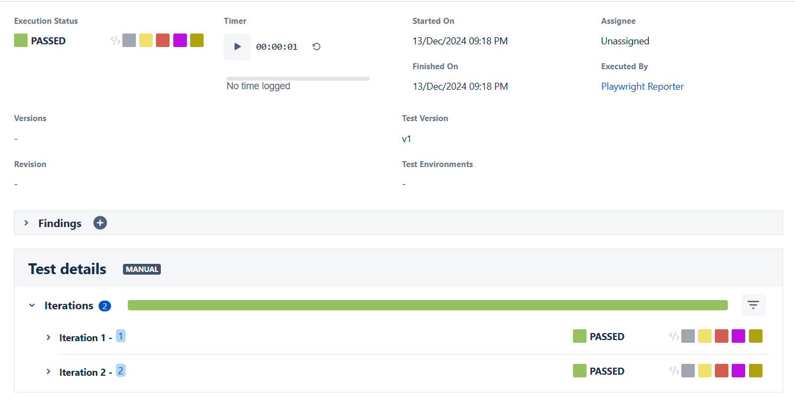
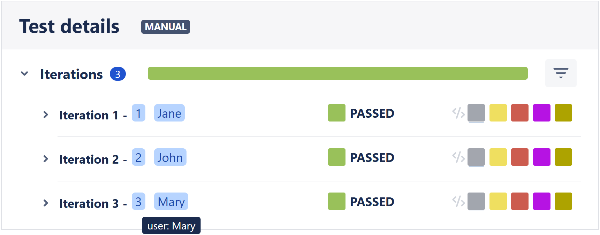

# Xray reporter for Playwright

Publish Playwright test run on Xray

NOTICE: Playwright Xray will move to its onw organization, were @NiklasBack will be owner also.
NPM install sshould not have any changes.

This reporter is based in playwright zephyr from Yevhen Laichenkov https://github.com/elaichenkov/playwright-zephyr
Thanks Yevhen for the great contribution

## Install

```sh
npm i -D playwright-xray
```

## Usage

Add reporter to your `playwright.config.ts` configuration file

### Cloud version

Authenticate with `client_id` and `client_secret` key. If your Xray instance is in a specified region, the API url can be configured by setting the cloud.xrayUrl parameter. By default, it will point to the US region with URL https://xray.cloud.getxray.app/

```typescript
// playwright.config.ts
import { PlaywrightTestConfig } from '@playwright/test';

const config: PlaywrightTestConfig = {
  reporter: [
    [
      'playwright-xray',
      {
        jira: {
          url: 'https://your-jira-url',
          type: 'cloud',
          apiVersion: '1.0',
        },
        cloud: {
          client_id: '',
          client_secret: '',
          // Optional: xrayUrl: '' if the xray region needs to be specified
        },
        projectKey: 'JIRA_CODE',
        testPlan: 'JIRA_CODEXXXXX',
        debug: false,
      },
    ],
  ],
};
```

### Server version

Authenticate with `token` key.

```typescript
// playwright.config.ts
import { PlaywrightTestConfig } from '@playwright/test';

const config: PlaywrightTestConfig = {
  reporter: [
    [
      'playwright-xray',
      {
        jira: {
          url: 'https://your-jira-url',
          type: 'server',
          apiVersion: '1.0',
        },
        server: {
          token: 'YOUR_SERVER_TOKEN',
        },
        projectKey: 'JIRA_CODE',
        testPlan: 'JIRA_CODEXXXXX',
        debug: false,
      },
    ],
  ],
};
```

Also, your playwright tests should include unique ID `J79` of your Xray test case + `|`. The library supports both single and multiple test case IDs N.B If you have different step definitions and steps in multiple test cases, the passed and failed will be related to step number. E.g. even if the action of the steps are copletley different the same steps vill be marked as passed or failed :


### Single Test Case ID:
```typescript
// Xray test case ID + |
test('J79 | basic test', async ({ page }) => {
  await page.goto('https://playwright.dev/');
  const title = page.locator('.navbar__inner .navbar__title');
  await expect(title).toHaveText('Playwright');
});
```

### Multiple Test Case IDs:
```typescript
// Multiple Xray test case IDs + |
test('J79,J80 | basic test', async ({ page }) => {
  await page.goto('https://playwright.dev/');
  const title = page.locator('.navbar__inner .navbar__title');
  await expect(title).toHaveText('Playwright');
});
```
**Note:** When using multiple test case IDs, separate them with commas  before the `|` separator.

### Optional config

Is it possible to add some optional values to the Test Execution ticket.

`projectsToExclude` - The Playwright projects that should not be reported to XRAY. Default is `undefined`. Othervise set it to array of values or to a single value, that is equal the name field of project in `playwright.config.ts`. E.g. [`setup`, `cleanup`] or `setup`.
RegExp can also be used e.g. `projectsToExclude = 'setup.*'`. If e.g. `projectsToExclude = 'firefox'` that conflicts with the command line argument e.g.`--project='firefox'` is used, then the `projectsToExclude` will be ignored.

```typescript
// playwright.config.ts
import { PlaywrightTestConfig } from '@playwright/test';

const config: PlaywrightTestConfig = {
  reporter: [
    [
      'playwright-xray',
      {
        jira: {
          url: 'https://your-jira-url',
          type: 'server',
          apiVersion: '1.0',
        },
        cloud: {
          client_id: '',
          client_secret: '',
          // Optional
          xrayUrl: '',
        },
        server: {
          token: '',
        },
        projectKey: 'JIRA_CODE',
        testPlan: 'JIRA_CODE-XXX',
        debug: false,
        // Optional
        testExecution: 'JIRA_CODE-YYY',
        version: 'v1.0',
        revision: '12345',
        executedBy: 'valid:accountid',
        description: 'This test was executed automatically',
        testEnvironments: ['dev', 'test'],
        uploadScreenShot: true,
        uploadTrace: true,
        uploadVideo: true,
        markFlakyWith: "FLAKY",
        stepCategories: ['test.step'],
        summary: `[${new Date().toLocaleString('fr-FR', { timeZone: 'Europe/Paris' })}] - Automated`,
        dryRun: false,
        runResult: true,
        projectsToExclude: ['setup', 'cleanup'],
        jiraXrayStatusMapping: {
          passed: "PASS",
          failed: "FAIL",
          skipped: "SKIPPED",
          timedOut: "FAIL",
          interrupted: "ABORTED",
        }
      },
    ],
  ],
};
```
## Explain jiraXrayStatusMapping

The `jiraXrayStatusMapping` configuration is **optional** and allows you to map Playwright test execution statuses to corresponding status values in **XRAY (Jira Test Management)**.

### Functionality
Playwright assigns specific statuses to test results, which may not directly align with the statuses used in XRAY. The `jiraXrayStatusMapping` option enables you to define how each Playwright status should be translated into an XRAY status.

If this option is not specified, XRAY will use its default status mapping.

### Example Configuration
The following example demonstrates how to map Playwright statuses to XRAY statuses:

```typescript
const config: PlaywrightTestConfig = {
  reporter: [
    [
      'playwright-xray',
      {
        jiraXrayStatusMapping: {
          passed: "PASS",
          failed: "FAIL",
          skipped: "SKIPPED",
          timedOut: "FAIL",
          interrupted: "ABORTED",
        }
      },
    ],
  ],
};
```

You can also customize the mapping for specific statuses as needed. For example, if you want to override only the skipped status:

```typescript
const config: PlaywrightTestConfig = {
  reporter: [
    [
      'playwright-xray',
      {
        jiraXrayStatusMapping: {
          skipped: "SOMETHING ELSE",
        }
      },
    ],
  ],
};
```
This configuration leaves all other statuses unchanged, relying on XRAY's default mappings.


## Authentication to Jira XRAY server
Supports either token base auth or basic auth using username and password. 
The token is the preferred method.

If server option is used, then either token or username and password must be provided.
But not both token and username plus password combination at the same time.

## Using token based authentication

```typescript
// playwright.config.ts
import { PlaywrightTestConfig } from '@playwright/test';

const config: PlaywrightTestConfig = {
  reporter: [
    [
      'playwright-xray',
      {
        server: {
          token: '',
        },
      },
    ],
  ],
};
```

## Using basic authentication

```typescript
// playwright.config.ts
import { PlaywrightTestConfig } from '@playwright/test';

const config: PlaywrightTestConfig = {
  reporter: [
    [
      'playwright-xray',
      {
        server: {
          username: '',
          password: '',
        },
      },
    ],
  ],
};
```

### Proxy

If you use a proxy to access Jira, you need to configure the proxy. This proxy information will be used by Axios to send the results to Jira.

```typescript
// playwright.config.ts
import { PlaywrightTestConfig } from '@playwright/test';

const config: PlaywrightTestConfig = {
  reporter: [
    [
      'playwright-xray',
      {
        jira: {
          url: 'https://your-jira-url',
          type: 'server',
          apiVersion: '1.0',
        },
        cloud: {
          client_id: '',
          client_secret: '',
        },
        server: {
          token: '',
        },
        projectKey: 'JIRA_CODE',
        testPlan: 'JIRA_CODE-XXX',
        debug: false,
        // Optional
        proxy: {
          protocol: 'http',
          host: '0.0.0.0',
          port: 80,
          auth: {
            username: 'USER',
            password: 'p@$$w0Rd',
          },
        },
      },
    ],
  ],
};
```

> If your proxy server doesn't need authentication, just omit the `auth` part.
>
> If no proxy is configured, Axios is forced to doesn't use proxy.

### Execution

Then run your tests with `npx playwright test` command and you'll see the result in console:

```sh
-------------------------------------

⏺  Starting the run with 6 tests
⏺  The following test execution will be imported & reported: Chrome

✅ Chrome | XRAYISSUE-2 | another test
✅ Chrome | XRAYISSUE-1 | basic test
✅ Firefox | XRAYISSUE-1 | basic test
⛔ Chrome | XRAYISSUE-3 | another test
⛔ Firefox | XRAYISSUE-2 | another test
⛔ Firefox | XRAYISSUE-3 | another test

-------------------------------------

😀 Successfully sending test results to Jira

⏺  Description:       Tests executed with playwright-xray plugin
⏺  Test environments: dev,test
⏺  Version:           3.5.2
⏺  Revision:          12345
⏺  Browser:           Chrome
⏺  Test plan:         XRAYISSUE-123
⏺  Test execution:    XRAYISSUE-324
⏺  Test Duration:     25s
⏺  Tests ran:         3 (including reruns)
⏺  Tests passed:      2
⏺  Tests failed:      1
⏺  Flaky test:        0

-------------------------------------

⏺  Test cycle XRAYISSUE-324 has been updated
👇 Check out the test result
🔗 https://jira.com/XRAYISSUE-324

-------------------------------------
```

And you'll see the result in the Xray:


## Multiple Projects

If you need to run multiple browsers, you need to use the project switch and run them after each other, e.g.
```console
npx playwright test --project=Chrome 
npx playwright test --project=Firefox
```
If multiple projects are selected in one run, only the first will be reported and imported to Xray. 

## Multiple Test Plans

If you need to send report for more than one test plan, you need to create a config file for each test plan.
Create a folder (e.g. configs) in your project and for each test plan, create a new playwright config file in this folder.

```ts
// configs/TCK-87.config.ts

import { PlaywrightTestConfig } from '@playwright/test';
import base from '../playwright.config';

const config: PlaywrightTestConfig = {
  ...base,
  testDir: '../tests',
  use: {
    ...base.use,
    headless: true,
  },
  reporter: [
    [
      'playwright-xray',
      {
        jira: {
          url: 'https://your-jira-url',
          type: 'server',
          apiVersion: '1.0',
        },
        server: {
          token: 'YOUR_SERVER_TOKEN',
        },
        projectKey: 'TCK',
        testPlan: 'TCK-87',
      },
    ],
  ],
};
export default config;
```

Now you can choose which config file you want to use executing the tests, using the command below:

```
npx playwright test --config=configs/TCK-87.config.ts
```

If no config file is chosen, the default config file "playwright.config.ts" will be used.

## Xray Iteration Support

The reporter supports data-driven tests and retries, mapping each run of the same test to an [iteration](https://docs.getxray.app/display/XRAYCLOUD/Parameterized+Tests) in Xray.

```typescript
for (const url of ['https://example.org', 'https://playwright.dev']) {
  test(`J42 | visit ${url}`, async ({ page }) => {
    await page.goto(url);
    await expect(page.locator('body')).toBeVisible();
  });
}
```



To specify actual iteration parameters, the utility function for defining Xray metadata can be used:

```typescript
import { setXrayMetadata } from 'playwright-xray';

for (const name of ['Jane', 'John', 'Mary']) {
  test(`XYZ-123 | log in as ${name}`, async ({ page }, testInfo) => {
    await setXrayMetadata(testInfo, { parameters: { user: name } })
    await page.goto(url);
    // ...
  });
}
```



When uploading, evidence for individual test runs is added to the test execution itself, as Xray does not support adding evidence to iterations outside of steps.

The reporter calculates Xray statuses for tests with iterations as follows:

- tests with iterations are considered passed if at least one iteration passed
- tests with iterations are considered failed if all iterations failed or timed out
- if there is at least one passed iteration, one failed iteration _and_ the the flaky flag is defined, the test will be reported as flaky

## Expose reporter options type
In order to enable IntelliSense to provide useful suggestions and avoid potential typos not being detected,
you can import XrayOptions in the "playwright.config.ts" file and use the TypeScript satisfies operator on the
playwright-xray configuration block. E.g:

```ts
import { PlaywrightTestConfig } from '@playwright/test';
import type { XrayOptions } from 'playwright-xray';

const config: PlaywrightTestConfig = {

  reporter: [
    [
      'playwright-xray',
      {
        jira: {
          url: 'https://your-jira-url',
          type: 'server',
          apiVersion: '1.0',
        },
        server: {
          token: 'YOUR_SERVER_TOKEN',
        },
        projectKey: 'TCK'
      } satisfies XrayOptions,
    ],
  ],
};

```

## Notes

- To have the steps imported you have to create them in the test issue itself.
  The steps will be imported by order of execution and inserted into the test.

- Xray only permits an upload size of maximum 100 MiB and subsequently playwright-xray will fail to upload the 
  execution result due to the total size of videos and traces exceeds this limit. In order to still be able to 
  update the Xray execution status while still being able to view the videos and traces in e.g. Jenkins the 
  switches `uploadScreenShot` and/ or `uploadTrace` set to `false` as shown below, can be used to exclude evidence from the Xray import file.

- Test that will pass after a rerun will be tagged with whatever is defined with the option "markFlakyWith"
  If this option is not set, the test will be tagged as PASSED. Please note that you have to define the
  Execution Status you choose in Xray, e.g. FLAKY.

- During the test run the reporter vill flag each test after execution as Passed, Failed, Flaky or skipped with the following symbols ✅, ⛔, ⚠️ and 🚫.
  There is though a caveat. If the tests are run in serial mode (test.describe.configure({ mode: 'serial' });) and the last test fails,
  then all tests fail even if e.g. the first test in the suite passed. This means that when the last test passes in a rerun, the first test will falsely be
  flagged as flaky (see https://playwright.dev/docs/test-retries#serial-mode) 

- Stepcategories defines how playwright-xray reporter should recognize test steps. The built-in categories in Playwright are the following:

* `hook` for fixtures and hooks initialization and teardown
* `expect` for expect calls
* `pw:api` for Playwright API calls.
* `test.step` for test.step API calls.

If the option `stepCategories` is not set, playwright-xray will default to `['expect', 'pw:api', 'test.step']` If e.g. only `['test.step']`
is defined, playwright-xray will only record code defined with `test.step('This is a test step', async () => { .... });` as a test step.

- The test execution summary defaults to `[${new Date().toUTCString()}] - Automated run` but this can be overidden by the
  config file option `summary:`

The option `dryRun` can be used to run the tests without uploading the results to Xray. If this option is set to true, the settings `client_id`
and `client_secret` are ignored, and the reporter will produce a `xray-payload.json` file that can be imported separately.

The option `runResult` will generate a `runresult.json` file containing a summary of the execution if is set to true (the default is false)

The option `limitEvidenceSize` will remove evidences starting with tha last failed test case if the upload request exceeds the specified value.
If the option is omitted, the upload will be limited to 100 MiB. If option debug is enabled, a `xray-payload-trim.json` file will be created.

```ts
[
      'playwright-xray',
      {
        jira: {
          url: 'https://your-jira-url',
          type: 'server',
          apiVersion: '1.0',
        },
        server: {
          token: 'YOUR_SERVER_TOKEN',
        },
        projectKey: 'TCK',
        testPlan: 'TCK-87',
        uploadScreenShot: false,
        uploadTrace: false,
        uploadVideo: false,
        markFlakyWith: "FLAKY",
        stepCategories: ['test.step'],
        summary: `[${new Date().toLocaleString('fr-FR', { timeZone: 'Europe/Paris' })}] - Automated`,
        dryRun: true,
        runResult: true,
        limitEvidenceSize: 100000000
      },
    ],
```
- Please ensure that you correctly type the e.g. testKey in the test or you might encounter {"error":"Invalid JQL query"}
  respnse, e.g. if you type TES- 49 instead of TES-49. 


## License

playwright-xray is [MIT licensed](./LICENSE).

## Contributors (special thanks for supporting the project), in alphabetical order:
- [Basti](https://github.com/csvtuda)
- [coolswood](https://github.com/coolswood)
- [MonishaNikhil](https://github.com/mons-ops)
- [NiklasBack](https://github.com/NiklasBack)
- [rodrigoodhin](https://github.com/rodrigoodhin)
- [roman-gyver](https://github.com/roman-gyver)


## Author

Fúlvio Carvalhido <inluxc@gmail.com>

## Supported by:

Diller <https://diller.no/>
