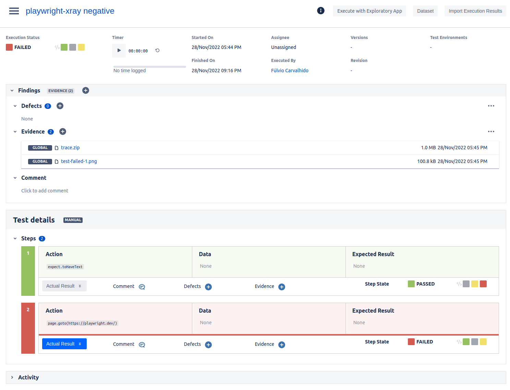

# Xray reporter for Playwright

Publish Playwright test run on Xray

This reporter is based in playwright zephyr from Yevhen Laichenkov https://github.com/elaichenkov/playwright-zephyr
Thanks Yevhen for the great contribution

## Install

```sh
npm i -D playwright-xray
```

## Usage

Add reporter to your `playwright.config.ts` configuration file


### Cloud version

Authenticate with `client_id` and `client_secret` key.

```typescript
// playwright.config.ts
import { PlaywrightTestConfig } from '@playwright/test';

const config: PlaywrightTestConfig = {
  reporter: [['playwright-xray', { 
    jira: {
      url: 'https://your-jira-url',
      type: 'cloud'
    },
    cloud: {
      client_id: '',
      client_secret: '',
    },
    projectKey: 'JIRA_CODE',
    testPlan: 'JIRA_CODEXXXXX',
    debug: false
  }]],
}
```

### Server version

Authenticate with `token` key.

```typescript
// playwright.config.ts
import { PlaywrightTestConfig } from '@playwright/test';

const config: PlaywrightTestConfig = {
  reporter: [['playwright-xray', { 
    jira: {
      url: 'https://your-jira-url',
      type: 'server'
    },
    server: {
      token: 'YOUR_SERVER_TOKEN'
    },
    projectKey: 'JIRA_CODE',
    testPlan: 'JIRA_CODEXXXXX',
    debug: false
  }]],
}
```

Also, your playwright tests should include unique ID inside square brackets `[J79]` of your Xray test case:

```typescript
// Xray test case ID inside square brackets
test('J79 | basic test', async ({ page }) => {
  await page.goto('https://playwright.dev/');
  const title = page.locator('.navbar__inner .navbar__title');
  await expect(title).toHaveText('Playwright');
});
```

### Optional config
Is it possible to add some optional values to the Test Execution ticket.
```typescript
// playwright.config.ts
import { PlaywrightTestConfig } from '@playwright/test';

const config: PlaywrightTestConfig = {
  reporter: [['playwright-xray', { 
    jira: {
      url: 'https://your-jira-url',
      type: 'server'
    },
    cloud: {
      client_id: '',
      client_secret: '',
    },
    server: {
      token: ''
    },
    projectKey: 'JIRA_CODE',
    testPlan: 'JIRA_CODE-XXX',
    debug: false,
    // Optional
    testExecution: 'JIRA_CODE-YYY',
    version: 'v1.0',
    revision: '12345',
    description: 'This test was executed automatically',
    testEnvironments: ['dev', 'test'],
  }]],
}
```

### Proxy
If you use a proxy to access Jira, you need to configure the proxy. This proxy information will be used by Axios to send the results to Jira.
```typescript
// playwright.config.ts
import { PlaywrightTestConfig } from '@playwright/test';

const config: PlaywrightTestConfig = {
  reporter: [['playwright-xray', { 
    jira: {
      url: 'https://your-jira-url',
      type: 'server'
    },
    cloud: {
      client_id: '',
      client_secret: '',
    },
    server: {
      token: ''
    },
    projectKey: 'JIRA_CODE',
    testPlan: 'JIRA_CODE-XXX',
    debug: false,
    // Optional
    proxy: {
      protocol: 'http',
      host: '0.0.0.0',
      port: 80,
      auth: {
        username: 'USER',
        password: 'p@$$w0Rd'
      }
    }
  }]],
}
```
> If your proxy server doesn't need authentication, just omit the `auth` part.
>
> If no proxy is configured, Axios is forced to doesn't use proxy.

### Execution

Then run your tests with `npx playwright test` command and you'll see the result in console:

```sh
-------------------------------------
 
🔸 Starting the run with 6 tests
 
✅ Chrome | XRAYISSUE-2 | another test
✅ Chrome | XRAYISSUE-1 | basic test
✅ Firefox | XRAYISSUE-1 | basic test
⛔ Chrome | XRAYISSUE-3 | another test
⛔ Firefox | XRAYISSUE-2 | another test
⛔ Firefox | XRAYISSUE-3 | another test
 
-------------------------------------
 
😀 Successfully sending test results to Jira
 
🔸 Description:       Tests executed with playwright-xray plugin
🔸 Test environments: dev,test
🔸 Version:           3.5.2
🔸 Revision:          12345
🔸 Browsers:          Chrome, Firefox
🔸 Test plan:         XRAYISSUE-123
🔸 Test execution:    XRAYISSUE-324
🔸 Test Duration:     25s 
🔸 Tests ran:         6
🔸 Tests passed:      3
🔸 Tests failed:      3
 
-------------------------------------
 
🔸 Test cycle XRAYISSUE-324 has been updated
👇 Check out the test result
🔗 https://jira.com/XRAYISSUE-324
 
-------------------------------------
```

And you'll see the result in the Xray:




## Multiple Test Plans

If you need to send report for more than one test plan, you need to create a config file for each test plan.
Create a folder (e.g. configs) in your project and for each test plan, create a new playwright config file in this folder.

``` ts
// configs/TCK-87.config.ts

import { PlaywrightTestConfig } from "@playwright/test";
import base from "../playwright.config";

const config: PlaywrightTestConfig = {
	...base,
	testDir: "../tests",
	use: {
		...base.use,
		headless: true,
	},
	reporter: [
		[
			"playwright-xray",
			{
				jira: {
          url: 'https://your-jira-url',
          type: 'server'
				},
				server: {
					token: 'YOUR_SERVER_TOKEN',
				},
        projectKey: 'TCK',
        testPlan: 'TCK-87'
			},
		],
	],
};
export default config;
```
Now you can choose which config file you want to use executing the tests, using the command below:
```
npx playwright test --config=configs/TCK-87.config.ts
```
If no config file is chosen, the default config file "playwright.config.ts" will be used.

## Notes

- To have the steps imported you have to create then in the test issue itself.
The steps will be imported by order of execution and inserted into the test.

## License

playwright-xray is [MIT licensed](./LICENSE).

## Author

Fúlvio Carvalhido <inluxc@gmail.com>

## Supported by:

Diller <https://diller.no/>
